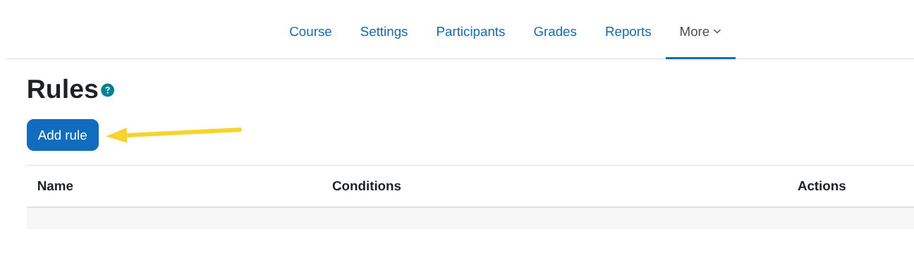
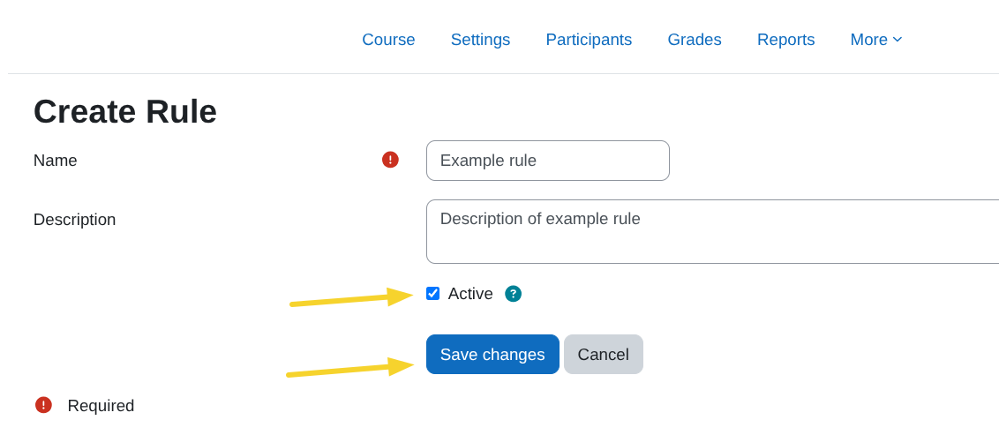
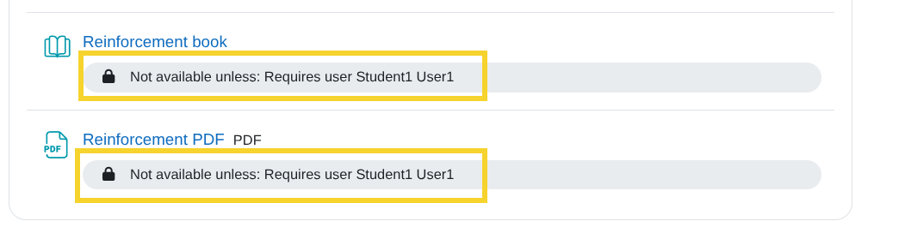
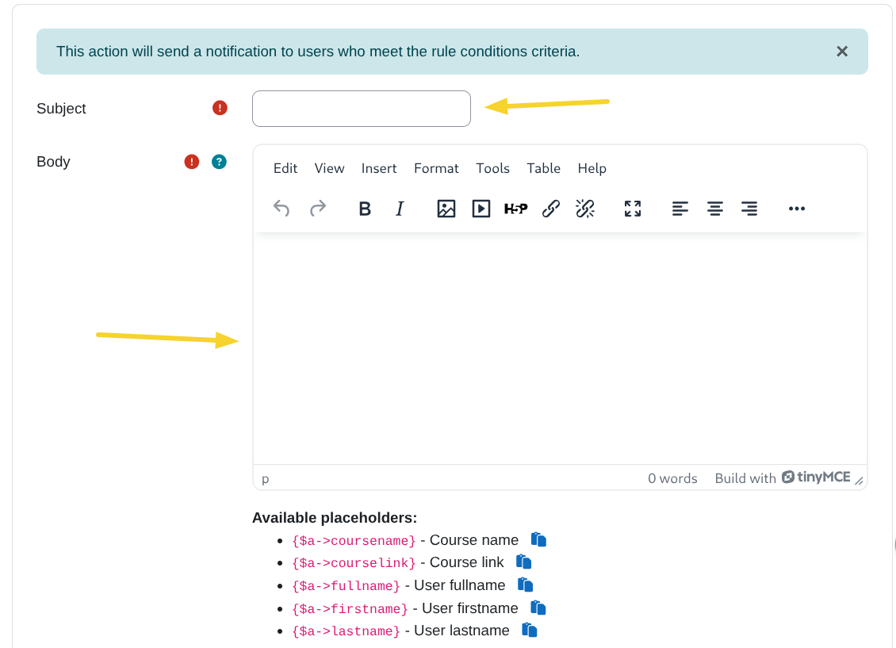
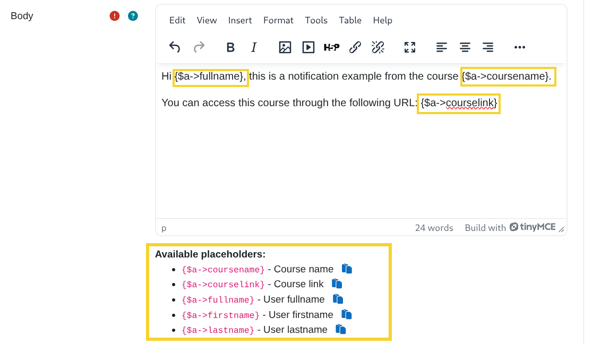

## Sobre reglas dinámicas del curso

Este plugin permite a los administradores y profesores definir reglas personalizadas que automatizan acciones basadas en condiciones específicas relacionadas con las actividades y los usuarios de un curso.

## Pre-requisitos

1. Tener minimo la versión de PHP 8.1 instalada en el servidor.

2. Tener la versión de Moodle 4.1.14 o superior instalada en el servidor.
   
3. Tener el cron de Moodle configurado y ejecutándose correctamente.

4. Tener instalada y activada la extensión ioncube loader en su versión 12 o superior en el servidor 
      - desde CPanel podemos hacerlo siguiendo las indicaciones del siguiente enlace: [https://support.cpanel.net/hc/en-us/articles/360062075814-How-to-enable-Ioncube-for-cPanel](https://support.cpanel.net/hc/en-us/articles/360062075814-How-to-enable-Ioncube-for-cPanel).
      - Alternativamente podemos realizar la instalación de forma manual siguiendo las instrucciones del siguiente enlace: [https://kinsta.com/blog/ioncube-loader/](https://kinsta.com/blog/ioncube-loader/)
   
5. Comprar plugin `Reglas dinámicas del Curso para Moodle LMS` desde nuestra tienda en la sección de complementos para Moodle https://shop.datacurso.com/index.php?rp=/store/plugins-moodle

6. Tener instalado el plugin de Moodle `Restriction by user` el cual se puede descargar de forma gratuita desde el siguiente enlace [https://moodle.org/plugins/availability_user/versions](https://moodle.org/plugins/availability_user/versions).

## Instalación mediante archivo ZIP subido

1. Inicie sesión en su sitio Moodle como administrador y vaya a `Administración del sitio > Extensiones > Instalar complementos`.
2. Suba el archivo ZIP con el código del plugin. Solo se le pedirá que agregue
    detalles adicionales si el tipo de plugin no se detecta automáticamente.
3. Verifique el informe de validación del plugin y finalice la instalación.

## Instalación manual

El plugin también se puede instalar colocando el contenido de este directorio en

`{su/moodle/dirroot}/local/coursedynamicrules`

Después, inicie sesión en su sitio Moodle como administrador y vaya a `Administración del sitio > General > Notificaciones` para completar la instalación.

Alternativamente, puede ejecutar
```bash
php admin/cli/upgrade.php
```

para completar la instalación desde la línea de comandos.

## Activación del plugin

Una vez que el plugin esté instalado, será necesario activarlo utilizando la llave de licencia proporcionada en la tienda del plugin, para ellos hacemos lo siguiente:

1. Accedemos a [https://shop.datacurso.com/clientarea.php](https://shop.datacurso.com/clientarea.php) y damos click sobre el servicio que queremos activar en este caso `Reglas dinámicas del Curso para Moodle LMS`.
   
   

2. Copiamos la clave de licencia.

    

3. En nuestra plataforma de Moodle accedemos a `Administración del sitio > Extensiones > Extensiones locales > Reglas dinámicas del curso > Configuración general` 
   
    

4. Pegamos la llave de licencia en el campo `Clave de licencia` y damos click en `Guardar cambios`.

    


4. Para validar si la licencia fue activada correctamente, accedemos a `Administración del sitio > Extensiones > Extensiones locales > Reglas dinámicas del curso > Verificar clave de licencia`
   
    

5. Si la licencia fue activada correctamente, veremos un mensaje de confirmación.

    


## Agregar reglas dinámicas a un curso

1. Accedemos al curso en el que queremos agregar reglas dinámicas y damos click en `Reglas dinámicas del curso` en el menú de administración del curso.
   
    

2. Damos click en `Agregar regla`.
   
    

3. Ingresamos el nombre de la regla, la descripción marcamos la casilla `Activa`
   
    

    
## Agregar condiciones a la regla

1. Damos click en el enlace `Agregar condiciones`.
   
    

2. Nos aparecerá una vista como la siguiente con la lista de condiciones disponibles desde donde podemos seleccionar la que deseamos agregar, la informaciona a cerca de cada condición la podemos encontrar en la siguiente sección [Condiciones disponibles](#condiciones-disponibles).
   
    

## Condiciones disponibles

### Calificación en actividad

#### Descripción  
Esta condición se utiliza para evaluar las calificaciones de los usuarios en una actividad que requiere calificación. Si la actividad seleccionada tiene múltiples ítems de calificación, se mostrará una lista desplegable con los ítems disponibles.  

Por ejemplo, en el caso del módulo `Foro`, los ítems de calificación disponibles podrían incluir:  
- Evaluación del foro completo  
- Calificaciones  

  
  

#### Configuración de la condición

1. **Buscar módulos de actividad del curso**:
   Desde este campo de busqueda podemos podemos seleccionar el módulo de actividad en el que deseamos verificar las calificaciones. 

   
   
   **Nota**: Solo aparecerán los modulos de actividad que tengan minimo la siguiente configuración en la sección de `Finalización de actividad`:

    

2. **Opciones de comparación**:  
   Una vez seleccionada la actividad, podemos definir las condiciones de comparación según los ítems de calificación disponibles. Se ofrecen dos opciones:  
   - `Debe ser ≥`: La condición se cumple si la calificación del usuario es mayor o igual al valor especificado.  
   - `Debe ser <`: La condición se cumple si la calificación del usuario es menor al valor especificado.  
  
    


### Actividad no completada

#### Descripción

Esta condición se utiliza para evaluar si un usuario no ha completado una actividad específica despues de un período de tiempo determinado.

Esta condición se ejecuta de forma recurrente mediante la tarea programada `local_coursedynamicrules\task\no_complete_activity_task` que por defecto se ejecuta cada minuto.

La condición solo evaluará una vez cuando se haya cumplido el tiempo especificado en la configuración de la condición, la cual se detalla en la siguiente sección [Configuración de la condición](#configuración-de-la-condición-1).

Una vez que se evalúe la condición y se ejecutan las acciones de la regla, la regla se desactivará automáticamente.

#### Configuración de la condición

1. **Buscar módulos de actividad del curso**:
   Desde este campo de busqueda podemos podemos seleccionar el módulo de actividad en el que deseamos verificar las calificaciones. 

   
   
   **Nota**: Solo aparecerán los modulos de actividad que tengan minimo la siguiente configuración en la sección de `Finalización de actividad`:

    

2. **Fecha esperada de finalización**:
    Definimos la fecha en la que esperamos que los usuarios hayan completado la actividad.

    


### Sin acceso al curso

#### Descripción

Esta condición se utiliza para evaluar que usuarios no han accedido a un curso dentro de un período de tiempo determinado.

Esta condición se ejecuta de forma recurrente mediante la tarea programada `local_coursedynamicrules\task\no_course_access_task` que por defecto se ejecuta cada minuto. 

Una vez que se agrega la condición a una regla, se empezará a evaluar a los usuarios que cumplan con la condición y se ejecutarán las acciones asociadas a la regla.

La condición se volverá a evaluar cada vez que haya pasado el periodo tiempo especificado en la configuración de la condición los cuales se detallan en la siguiente sección [Configuración de la condición](#configuración-de-la-condición-2).

#### Configuración de la condición

1. **Periodo**:
   Definimos el periodo de tiempo en el que esperamos que los usuarios hayan accedido al curso en el primer campo ingresamos el valor y en el segundo seleccionamos la unidad de tiempo.

    

### Finalización de actividad con calificación aprobatoria

#### Descripción

Esta condición se utiliza para evaluar si los usuarios han completado una actividad con una calificación aprobatoria.

#### Configuración de la condición

1. **Buscar módulos de actividad del curso**:
   Desde este campo de busqueda podemos podemos seleccionar el módulo de actividad en el que deseamos verificar las calificaciones. 

    
   
   **Nota**: Solo aparecerán los modulos de actividad que tengan minimo la siguiente configuración en la sección de `Finalización de actividad`:

    


## Agregar acciones a la regla

1. Damos click en el enlace `Agregar acciones`.
   
    

2. Nos aparecerá una vista como la siguiente con la lista de acciones disponibles desde donde podemos seleccionar la que deseamos agregar, la informaciona a cerca de cada acción la podemos encontrar en la siguiente sección [Acciones disponibles](#acciones-disponibles).
   
    

## Acciones disponibles

### Habilitar actividad

#### Descripción

Esta acción se utiliza para habilitar actividades específicas en el curso para usuarios que cumplan con las condiciones de la regla.

**Nota**: Para poder usar esta acción es necesario instalar el plugin `Restriction by user` el cual se puede descargar de forma gratuita desde el siguiente enlace [https://moodle.org/plugins/availability_user/versions](https://moodle.org/plugins/availability_user/versions).

#### Configuración de la acción

1. **Buscar módulos de actividad del curso**:
   Desde este campo de busqueda podemos podemos seleccionar los modulos de actividad que deseamos habilitar.

    

    Las actividades seleccionadas solo quedarán disponibles para los usuarios que cumplan con las condiciones de la regla, desde la vista del curso para roles con permisos necesarios (profesores, administradores, etc.) se mostrará la siguiente información que indica los usuarios para los cuales la actividad está habilitada:

    


### Enviar notificación

#### Descripción

Esta acción se utiliza para enviar notificaciones a los usuarios que cumplan con las condiciones de la regla.

#### Mejore el envío de notificaciones

¡Mejore sus notificaciones! con nuestros plugins de <strong>Datacurso Message Hub</strong> los cuales le permitirán enviar notificaciones por WhatsApp y SMS usando proveedores como Twilio. [Click aquí para comprarlos y activarlos ahora!](https://shop.datacurso.com/clientarea.php)

Para obtener mas información puede visitar la pagina de documentación [https://docs.datacurso.com/index.php?title=Message_Hub](https://docs.datacurso.com/index.php?title=Message_Hub)

#### Configurar el envío de notificaciones (Necesario solo si no tiene instalado los plugins de Datacurso Message Hub)

1. Acceder a `Administración del sitio > General > Mensajería > Ajustes de notificación`
   
    

2. En la sección `Preferencias de notificación predeterminadas` ubicamos `Notificación de reglas dinámicas del curso` y habilitamos la opción para `Datacurso Message Hub`

    

#### Configuración de la acción

1. **Asunto**:
   Definimos el asunto de la notificación.

2. **Cuerpo**: 
   Definimos el cuerpo de la notificación.

    

3. **Marcadores de posición**:
    Podemos utilizar marcadores de posición en el cuerpo de la notificación para que el mensaje sea mas personalizado para cada usuario, los marcadores de posición disponibles son:

    - `{$a->coursename}` - Nombre del curso
    - `{$a->courselink}` - Enlace del curso
    - `{$a->fullname}` - Nombre completo del usuario
    - `{$a->firstname}` - Nombre del usuario
    - `{$a->lastname}` - Apellido del usuario
    
     


