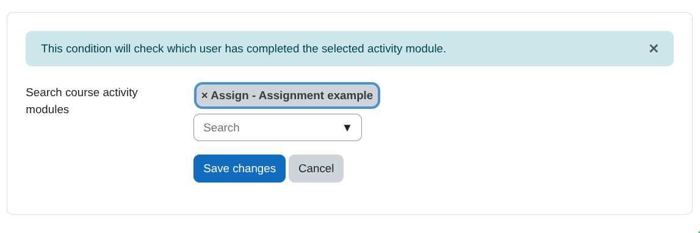
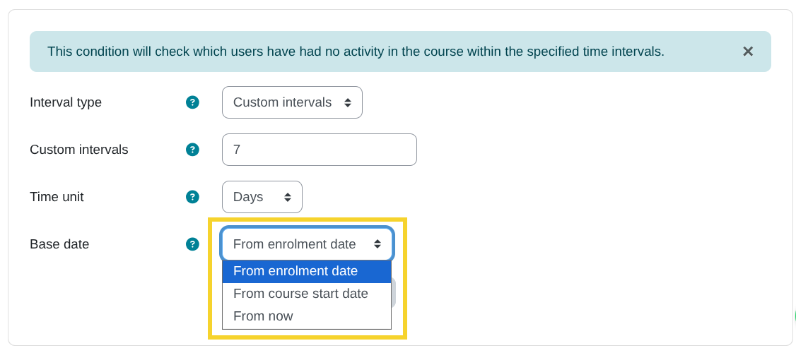
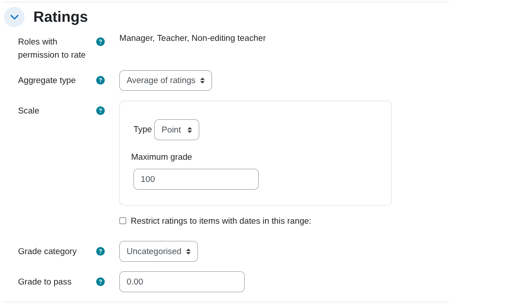
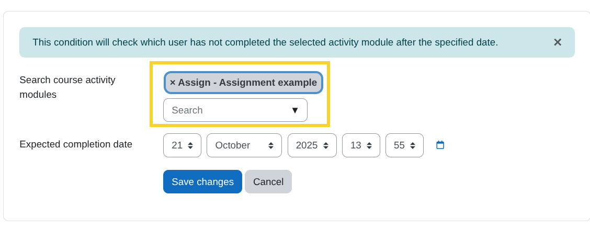
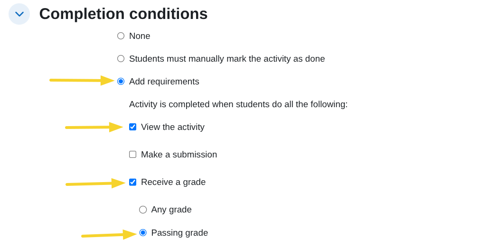
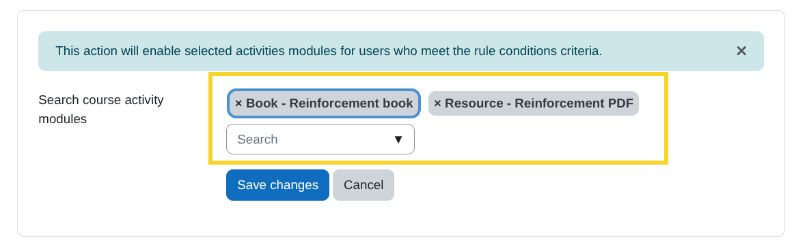
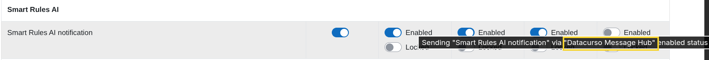
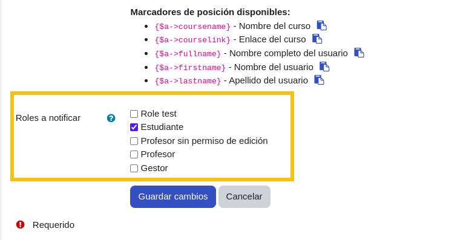

## Smart Rules AI

This plugin allows administrators and teachers to define custom rules that automate actions based on specific conditions related to course activities and users.

## Prerequisites

1. Have Moodle version 4.1.14 or higher.
   
2. Have Moodle cron configured and running correctly.
   
3. **Optional** Have the Moodle plugin `Restriction by user` installed (required for the [Create AI activity](#create-ai-activity) action), which can be downloaded for free from the following link [https://moodle.org/plugins/availability_user/versions](https://moodle.org/plugins/availability_user/versions).
4. **Optional** Have the Moodle plugin `Course Creator AI` installed (required for the [Create AI activity](#create-ai-activity) action), which can be downloaded for free from the following link [https://moodle.org/plugins/availability_user/versions](https://moodle.org/plugins/availability_user/versions).

## Installing via uploaded ZIP file

1. Log in to your Moodle site as an admin and go to `Site administration > Plugins > Install plugins`.
2. Upload the ZIP file with the plugin code. You should only be prompted to add
   extra details if your plugin type is not automatically detected.
3. Check the plugin validation report and finish the installation.

## Installing manually

The plugin can be also installed by putting the contents of this directory to

`{your/moodle/dirroot}/local/coursedynamicrules`

Afterwards, log in to your Moodle site as an admin and go to `Site administration > Notifications` to complete the installation.

Alternatively, you can run

```bash
php admin/cli/upgrade.php
```

to complete the installation from the command line.

## Adding rules to a course

1. Access the course in which you want to add smart rules and click on `Smart rules` in the course administration menu.
   
    

2. Click on `Add rule`.
   
    

3. Enter the name of the rule, the description and check the `Active` box.
   
    

    
## Adding conditions to the rule

1. Click on the link `Add conditions`.
   
    

2. A view similar to the following will appear with the list of available conditions from which we can select the one we want to add, the information about each condition can be found in the following section [Available conditions](#available-conditions).
   
    

## Available conditions

### Activity completed

#### Description

This condition allows you to easily identify students who have completed a specific activity in the course. It can be configured to send automatic reminders to those who have completed the activity, helping you maintain their commitment and reduce inactivity.

#### Condition configuration

1. **Search course activity modules**: From this search field we can select the activity module that we want to verify that it has been completed.
   
   

### Course inactivity at time intervals

#### Description

This condition makes it easy to identify students who have not accessed the course for specific periods of time from a base date, such as their enrolment date. You can configure it to send automatic reminders to those who have gone 7, 15, 22 days (or any desired interval) without entering the course, helping you maintain engagement and reduce inactivity.

Whether by evaluating custom intervals or by recurring monitoring at a fixed cadence, this condition helps keep students engaged and active in the course.

This condition runs recurrently every day at `00:00`, `06:00`, `12:00`, and `18:00` via the scheduled task `local_coursedynamicrules\task\course_inactivity_task`.

**IMPORTANT!** Do not modify this scheduled task's execution times, as it may cause inconsistencies when evaluating the condition.

#### Condition configuration

1. **Custom intervals**:
    Allows you to enter multiple time intervals separated by commas `(,)`, for example: `7,15,22`. The condition will be evaluated at each specified interval, in this case every 7, 15, and 22 `days` or `weeks` or `months`, depending on the selected time unit.
    
     

2. **Recurring interval**:
   Allows you to enter a single interval so the condition is evaluated repeatedly at the specified cadence, for example: `7`, which means the evaluation runs every 7 `days` or `weeks` or `months`, depending on the selected time unit.

    

3. **Time unit**:
   Select the unit of time in which the condition will be evaluated. Available options: `days`, `weeks`, `months`.
   
    

4. **Base date**:
   Select the base date from which the condition will be evaluated. Available options:
   - `From enrolment date`: Intervals are counted from each user's enrolment date in the course.
   - `From course start date`: Intervals are counted from the course start date.
   - `From now`: Intervals are counted from the date the rule is created.

    
   
### Grade in activity

#### Description  
Use this condition to evaluate users' grades in a gradable activity. If the selected activity has multiple grade items, a dropdown will be shown with the available items.  

For example, in the `Forum` module, available grade items may include:  
- Whole forum grading  
- Grades  

  
  

#### Condition configuration

1. **Search course activity modules**:
   From this search field, select the activity module where you want to check grades. 

   
   
   **Note**: Only activity modules that have at least the following setting in the `Activity completion` section will appear:

    

2. **Comparison options**:  
   After selecting the activity, define the comparison conditions based on the available grade items. Two options are provided:  
   - `Must be ≥`: The condition is met if the user's grade is greater than or equal to the specified value.  
   - `Must be <`: The condition is met if the user's grade is less than the specified value.  
  
    


### Activity not completed

#### Description
Use this condition to evaluate whether a user has not completed a specific activity after a given period of time.

This condition runs recurrently via the scheduled task `local_coursedynamicrules\task\no_complete_activity_task`, which by default runs every minute.

The condition will only evaluate once when the time specified in the configuration has elapsed, as detailed in the section [Condition configuration](#condition-configuration-1).

After the condition is evaluated and the rule's actions are executed, the rule will be automatically deactivated.

#### Condition configuration

1. **Search course activity modules**:
   From this search field, select the activity module you want to verify has not been completed.

   
   
   **Note**: Only activity modules that have at least the following setting in the `Activity completion` section will appear:

    

2. **Expected completion date**:
    Define the date by which you expect users to have completed the activity.

    


### No course access

#### Description
Use this condition to evaluate which users have not accessed a course within a specified period of time.

This condition runs recurrently via the scheduled task `local_coursedynamicrules\task\no_course_access_task`, which by default runs every minute. 

Once the condition is added to a rule, users matching the condition will start being evaluated and the rule's actions will be executed.

The condition will be re-evaluated each time the time period specified in the configuration has passed, as detailed in the following section [Condition configuration](#condition-configuration-2).

#### Condition configuration

1. **Period**:
   Define the time period in which you expect users to have accessed the course. Enter the numeric value in the first field and select the time unit in the second field.

    

### Activity completion with passing grade

#### Description
Use this condition to evaluate whether users have completed an activity with a passing grade.

#### Condition configuration

1. **Search course activity modules**:
   From this search field, select the activity module where you want to verify grades. 

    
   
   **Note**: Only activity modules that have at least the following setting in the `Activity completion` section will appear:

    


## Add actions to the rule

1. Click the `Add actions` link.
   
    

2. A view like the following will appear with the list of available actions. Select the one you want to add. Details of each action can be found in the next section [Available actions](#available-actions).
   
    

## Available actions

### Create AI reinforcement activity (Only for moodle 4.5 or higher)

#### Description
This action will request the Datacurso AI service to generate a personalised reinforcement activity for users who meet the rule conditions.

#### Pre-requisites
1. Moodle 4.5 or higher
2. Have the `Restriction by user` plugin installed and enabled, which can be downloaded for free from: [https://moodle.org/plugins/availability_user](https://moodle.org/plugins/availability_user).
3. Have the `Course Creator AI` plugin installed and enabled, which can be downloaded for free from: [https://moodle.org/plugins/local_coursegen](https://moodle.org/plugins/local_coursegen).

#### Action configuration

1. **Prompt**:
   Enter the instruction that the AI will use to generate the reinforcement activity.

   - You can include placeholders to personalise the prompt for each user. Available placeholders:
     - `{$a->coursename}` – Course name
     - `{$a->courseurl}` – Course URL
     - `{$a->fullname}` – User full name
     - `{$a->firstname}` – User first name
     - `{$a->lastname}` – User last name

2. **Generate images**:
   If enabled, the AI may generate and include images in the created activity when supported by the target activity type.

3. **Section**:
   Select the course section where the activity will be created.

4. **Insert before**:
   Optionally choose an existing activity to insert the new activity before. If set to `None`, the new activity will be appended at the end of the selected section.


### Enable activity

#### Description
Use this action to enable specific activities in the course for users who meet the rule's conditions.

#### Pre-requisites

1. Have the `Restriction by user` plugin installed and enabled, which can be downloaded for free from: [https://moodle.org/plugins/availability_user](https://moodle.org/plugins/availability_user).

#### Action configuration

1. **Search course activity modules**:
   From this search field, select the activity modules you want to enable.

    

    The selected activities will only be available to users who meet the rule's conditions. In the course view for roles with the necessary permissions (teachers, administrators, etc.), the following information will be shown indicating the users for whom the activity is enabled:

    


### Send notification

#### Description
Use this action to send notifications to users who meet the rule's conditions.

#### Improve notification delivery

Enhance your notifications with our <strong>Datacurso Message Hub</strong> plugins, which let you send notifications via WhatsApp and SMS using providers like Twilio. [Click here to purchase and activate now!](https://shop.datacurso.com/clientarea.php)

For more information, visit the documentation page: [https://docs.datacurso.com/index.php?title=Message_Hub](https://docs.datacurso.com/index.php?title=Message_Hub)

#### Configure notification sending (Required only if you have the Datacurso Message Hub plugins installed)

1. Go to `Site administration > General > Messaging > Notification settings`
   
    

2. In the `Default notification preferences` section, find `Smart Rules AI notification` and enable the option for `Datacurso Message Hub`.

    
    

#### Action configuration

1. **Subject**:
   Define the notification subject.

2. **Body**: 
   Define the notification body.

    

3. **Placeholders**
    You can use placeholders in the notification body to personalize the message for each user. Available placeholders:
    
    - `{$a->coursename}` - Course name
    - `{$a->courselink}` - Course link
    - `{$a->fullname}` - User full name
    - `{$a->firstname}` - User first name
    - `{$a->lastname}` - User last name
    
     

4. **Roles to notify**:
   Select the roles of which the user must have at least one assigned in the course for the notification to be sent. For example, if you want only users with the student role to be notified, check the `Student` box.

    


### What happens when the action runs:
   - The action sends the configured prompt to the Datacurso AI service via the `Course Creator AI` plugin and receives the activity definition.
   - If the course has any AI context configured (e.g., instructional model or syllabus), this context will be used to create an activity better aligned with the course.
   - A new course module is created and placed in the selected section and position.
   - The new activity is made visible and is restricted to the matched user using the `Restriction by user` condition.

## License

2025 Data Curso LLC <https://datacurso.com>

This program is free software: you can redistribute it and/or modify it under
the terms of the GNU General Public License as published by the Free Software
Foundation, either version 3 of the License, or (at your option) any later
version.

This program is distributed in the hope that it will be useful, but WITHOUT ANY
WARRANTY; without even the implied warranty of MERCHANTABILITY or FITNESS FOR A
PARTICULAR PURPOSE.  See the GNU General Public License for more details.

You should have received a copy of the GNU General Public License along with
this program.  If not, see <https://www.gnu.org/licenses/>.