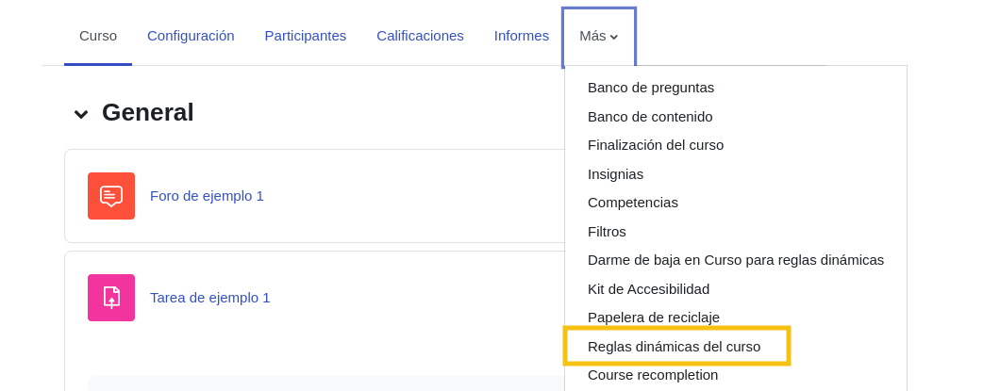

# Reglas dinámicas del curso

## Sobre reglas dinámicas del curso

Este plugin permite crear reglas dinamicas para los cursos de Moodle.

## Instalación mediante archivo ZIP subido

1. Inicie sesión en su sitio Moodle como administrador y vaya a `Administración del sitio > Extensiones > Instalar complementos`.
2. Suba el archivo ZIP con el código del plugin. Solo se le pedirá que agregue
    detalles adicionales si el tipo de plugin no se detecta automáticamente.
3. Verifique el informe de validación del plugin y finalice la instalación.

## Instalación manual

El plugin también se puede instalar colocando el contenido de este directorio en

`{su/moodle/dirroot}/local/coursedynamicrules`

Después, inicie sesión en su sitio Moodle como administrador y vaya a `Administración del sitio > General > Notificaciones` para completar la instalación.

Alternativamente, puede ejecutar
```bash
php admin/cli/upgrade.php
```

para completar la instalación desde la línea de comandos.

## Activación del plugin

Una vez que el plugin esté instalado, será necesario activarlo utilizando la llave de licencia proporcionada en la tienda del plugin, para ellos hacemos lo siguiente:

1. Accedemos a [https://shop.datacurso.com/clientarea.php](https://shop.datacurso.com/clientarea.php) y damos click sobre el servicio que queremos activar en este caso `Moodle - Reglas dinámicas del Curso para Moodle LMS`.
   
   

2. Copiamos la clave de licencia.

    

3. En nuestra plataforma de Moodle accedemos a `Administración del sitio > Extensiones > Extensiones locales > Reglas dinámicas del curso > Configuración general` 
   
    

4. Pegamos la llave de licencia en el campo `Clave de licencia` y damos click en `Guardar cambios`.

    


4. Para validar si la licencia fue activada correctamente, accedemos a `Administración del sitio > Extensiones > Extensiones locales > Reglas dinámicas del curso > Verificar clave de licencia`
   
    

5. Si la licencia fue activada correctamente, veremos un mensaje de confirmación.

    


## Agregar reglas dinámicas a un curso

1. Accedemos al curso en el que queremos agregar reglas dinámicas y damos click en `Reglas dinámicas del curso` en el menú de administración del curso.
   
    

2. Damos click en `Agregar regla`.
   
    

3. Ingresamos el nombre de la regla, la descripción marcamos la casilla `Activa`
   
    

    
## Agregar condiciones a la regla

1. Damos click en el enlace `Agregar condiciones`.
   
    

2. Nos aparecerá una vista como la siguiente con la lista de condiciones disponibles desde donde podemos seleccionar la que deseamos agregar, la informaciona a cerca de cada condición la podemos encontrar en la siguiente sección [Condiciones disponibles](#condiciones-disponibles).
   
    

## Condiciones disponibles

### Calificación en actividad

La condición "Calificación en actividad" permite verificar qué usuarios han obtenido una calificación específica en un módulo de actividad seleccionado.

#### Descripción  
Esta condición se utiliza para evaluar las calificaciones de los usuarios en una actividad que requiere calificación. Si la actividad seleccionada tiene múltiples ítems de calificación, se mostrará una lista desplegable con los ítems disponibles.  

Por ejemplo, en el caso del módulo `Foro`, los ítems de calificación disponibles podrían incluir:  
- Evaluación del foro completo  
- Calificaciones  

  
  

#### Configuración de la condición

1. **Selección de actividad**:
   Utilizamos el campo de búsqueda para seleccionar el módulo de actividad en el que deseamos verificar las calificaciones. Solo aparecerán actividades configuradas con elementos de calificación.

2. **Opciones de comparación**:  
   
   

   Una vez seleccionada la actividad, podemos definir las condiciones de comparación según los ítems de calificación disponibles. Se ofrecen dos opciones:  
   - `Debe ser ≥`: La condición se cumple si la calificación del usuario es mayor o igual al valor especificado.  
   - `Debe ser <`: La condición se cumple si la calificación del usuario es menor al valor especificado.  


